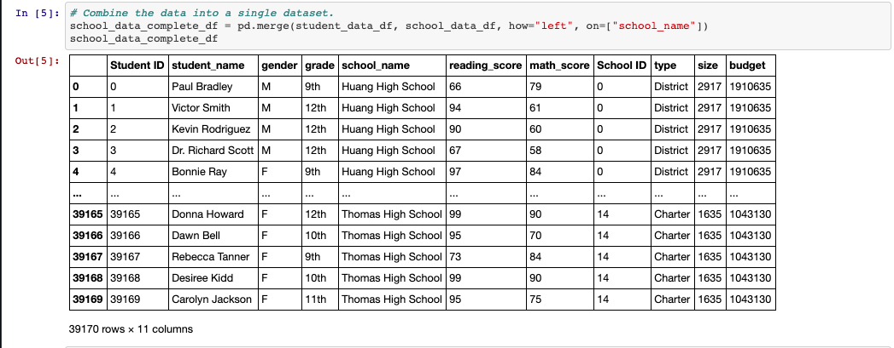
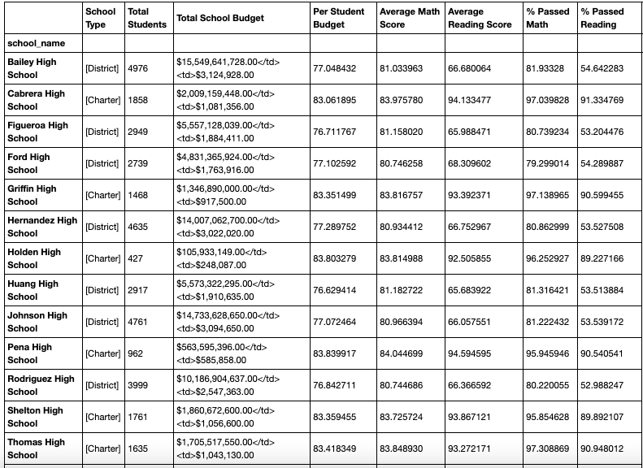
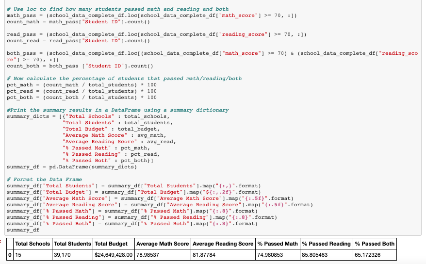
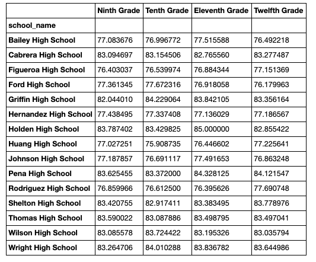
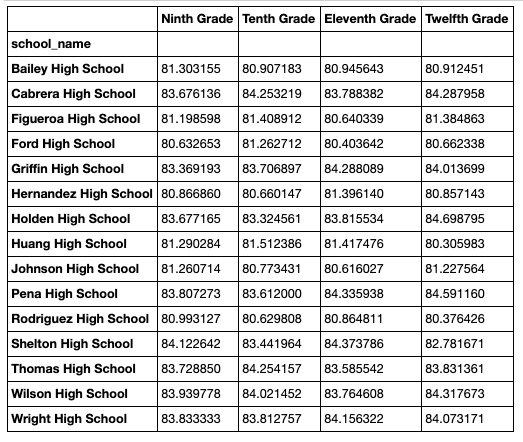

PyCitySchools

In this challenge, I extract data from a district of 15 schools and analyze the passing rates of math and reading state exams.

Special consideration is taken with respect to the type of school (charter or public).
Special consideration is taken with respect to the size of school (small, medium, or large).
Special consideration is taken with respect to the total budget of the school per student.

Using pandas, I display this data in an easy to view way using Data Frames.

A summary data frame is displayed for all of the schools scores.

And lastly, we see the average math scores of every school:

and the average reading scores of every school:

